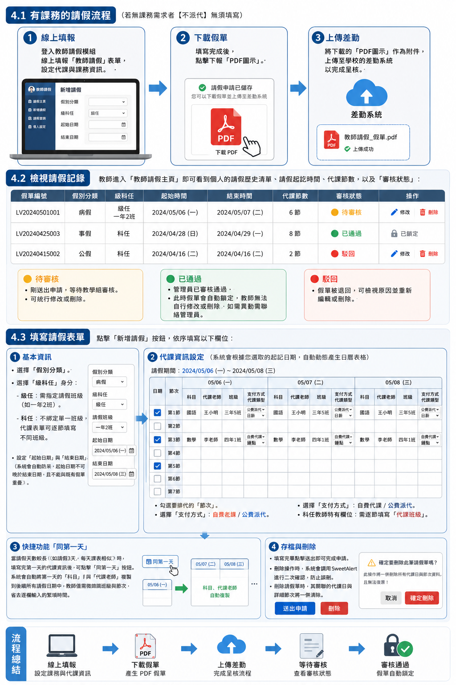

# 教師請假模組 `jill_leave` 使用手冊

本模組專為學校設計，旨在提供教學組與相關管理人員掌握教師請假的調代課資訊，並能快速生成鐘點費清冊與 PDF 假單，減少行政作業流程。

---

## 1. 模組簡介與環境要求

### 1.1 模組目的
- 提供教師便捷的線上請假與排代課申請。
- 自動化統計代課節次，支援一鍵匯出「鐘點費清冊」(Excel) 與「請假單」(PDF)。
- 前台公告請假動態，利於校內同仁掌握課務狀況。

### 1.2 系統環境需求
- **XOOPS 版本**：2.5.11+
- **PHP 版本**：8.0+
- **必要依賴模組**：`tadtools`

### 1.3 安裝與升級
1. 將 `jill_leave` 資料夾上傳至 XOOPS 網站的 `modules/` 目錄下。
2. 以管理員身份登入 XOOPS 後台，進入「模組管理」->「安裝模組」。
3. 找到「教師請假」模組並點擊「安裝」按鈕。
4. **注意**：若未來有新版本釋出，請將新檔覆蓋舊檔後，至「模組管理」點擊「更新」即可。

---

## 2. 系統參數設定（管理員專區）

安裝完成後，管理員應先至模組後台或前台的「系統參數」進行基礎設定，以利後續功能正常運作。

### 2.1 管理人員 Email (`adm_email`)
- **功能描述**：設定具備本模組最高管理權限（如：審核假單、修改任意假單、匯出報表）的人員 Email。
- **設定方式**：多筆 Email 請以英文分號「`;`」隔開（例如：`admin@school.edu.tw;office@school.edu.tw`）。設定完成後，這些人員重新登入網站後即具備管理權限。

### 2.2 設定全校年級 (`grade`)
- **功能描述**：限定前台請假時可供選擇的年級範圍。
- **設定方式**：例如國小可設為 `1,2,3,4,5,6`。

### 2.3 設定全校最多班級 (`class_room`)
- **功能描述**：設定各年級的最大班級數，用以動態生成班級下拉選單。
- **設定方式**：如全校最多班級數是六年級共 10 班，則填入 `10`，系統即會自動產生 `1班` 到 `10班` 的選項。

### 2.4 節次設定 (`class_period`)
- **功能描述**：自訂學校的授課節次。
- **設定方式**：使用英文逗號「`,`」隔開。例如：`早自修,第1節,第2節,第3節,第4節,第5節,第6節,第7節`。

---

## 3. 假別分類管理（管理員專區）

在教師開始請假前，管理員需先建立學校適用的假別（如：事假、病假、公差假等）。

- **入口路徑**：前台選單 -> 「假別分類」（僅管理員可見）。
- **新增/修改假別**：輸入「假別名稱」，並選擇「狀態」（啟用 / 停用）。
- **排序調整**：假別清單支援 **AJAX 拖曳排序**，直接在前台拖拉假別列即可即時儲存排序，無需手動點擊保存。

---

## 4. 教師請假申請（教師前台）

一般教師登入後，即可在前台進行請假申請與課務排代。

> [!IMPORTANT]
> **手機介面限制**：手機介面可能因螢幕太小而無法完整填報課務資訊，建議使用平板或桌上型電腦進行填報。

### 4.1 有課務的請假流程
若請假期間有課務需排代（無課務需求者【不派代】無須填寫），請遵循以下流程：

1. **線上填報**：登入教師請假模組，於線上填報「教師請假」表單，設定代課與課務資訊。
2. **下載假單**：填寫完成後，點擊下載「PDF圖示」。
3. **上傳差勤**：將下載的「PDF圖示」作為附件，上傳至學校的差勤系統以完成呈核。

### 4.2 檢視請假記錄
- 教師進入「教師請假主頁」即可看到個人的請假歷史清單、請假起訖時間、代課節數，以及「審核狀態」：
  - 🟡 **待審核**：剛送出申請，等待教學組審核。可進行修改或刪除。
  - 🟢 **已通過**：管理員已審核通過。**此時假單會自動鎖定**，教師無法自行修改或刪除。如需異動需聯絡管理員。
  - 🔴 **駁回**：假單被退回，可檢視原因並重新編輯或刪除。

### 4.3 填寫請假表單
點擊「新增請假」按鈕，依序填寫以下欄位：

1. **基本資訊**：
   - 選擇「假別分類」。
   - 選擇「級科任」身分：
     - **級任**：需指定請假班級（如一年2班）。
     - **科任**：不綁定單一班級，代課表單可逐節填寫不同班級。
   - 設定「起始日期」與「結束日期」（系統會自動防呆，起始日期不可晚於結束日期，且不能與既有假單重疊）。

2. **代課資訊設定**（系統會根據您選取的起訖日期，自動動態產生日曆表格）：
   - 對於請假區間的每一天，勾選要排代的「節次」（如：第1節、第3節）。
   - 填寫「科目」。
   - 填寫「代課老師」姓名。
   - 選擇「支付方式」：
     - **自費代課**：教師自付代課費。
     - **公費派代**：由學校公費支付。
   - 選擇「代課類型」：
     - **日薪** / **鐘點**。
   - **科任教師特有欄位**：科任教師需逐節填寫「代課班級」（例如第1節代三年5班，第2節代四年1班）。

3. **快捷功能「同第一天」**：
   - 當請假天數較長（如請假3天，每天課表相似）時，填寫完第一天的代課資訊後，可點擊「同第一天」按鈕。
   - 系統會自動將第一天的「科目」與「代課老師」複製到後續所有請假日期中，教師僅需微調班級與節次，省去逐欄輸入的繁瑣時間。

4. **存檔與刪除**：
   - 填寫完畢點擊送出即可完成申請。
   - 刪除操作時，系統會調用 `SweetAlert` 進行二次確認，防止誤刪。刪除請假單時，其關聯的代課日與詳細節次將一併清除。

---

## 5. 代課管理與報表匯出（管理員專區）

具備管理權限的人員（列於 `adm_email` 中者）登入後，前台會顯示「代課管理」功能。

### 5.1 假單審核與總覽
- 可依「月份」篩選全校所有教師的請假與代課記錄。
- 管理員可在此直接「刪除」或「修改」任意假單（不受已通過鎖定的限制）。
- 可對待審核的假單進行「通過」或「駁回」操作。

### 5.2 匯出鐘點費清冊 (Excel)
- **使用時機**：每個月底申報代課鐘點費時。
- **操作步驟**：篩選指定月份後，點擊「匯出鐘點費清冊」按鈕，系統會自動生成 Excel 格式的鐘點費明細，包含代課教師、代課節數、金額等，方便出納或人事單位核銷。

### 5.3 匯出/列印請假單 (PDF)
- **使用時機**：假單審核通過後，需要列印實體假單存檔或呈核時。
- **操作步驟**：在假單列表中，點擊該筆假單旁的「PDF」圖示，系統會直接輸出該請假單 of PDF 檔案以供下載或列印。

---

## 6. 請假公告區塊

本模組附帶一個「請假公告」區塊，可用於放置在學校入口網站的側邊欄或首頁。

- **顯示內容**：自動列出「審核已通過」的教師公告。
- **過期隱藏**：若請假結束日期已過（結束日期小於今天），該筆紀錄會自動從區塊中隱藏，確保公告的即時性。
- **管理設定**：管理員可在 XOOPS 區塊管理中，設定此區塊要顯示的最多筆數。
